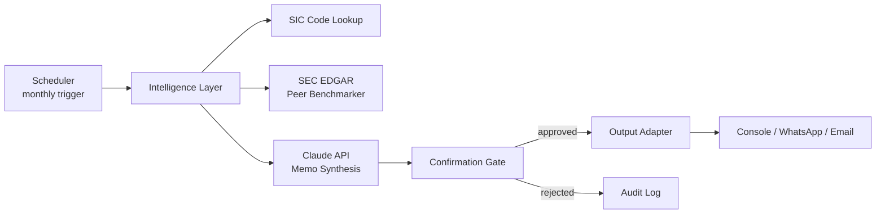

# multi-agent-cfo

> A multi-agent platform that generates monthly CFO-style memos for a portfolio of companies — peer-benchmarked against SEC EDGAR data, synthesized by Claude, and gated by human approval before delivery.

## Why this exists

Most LLM agent demos are either toys (chatbots) or black boxes (single-agent monoliths). This project is a reference implementation of a different pattern: a **production-shaped, confirmation-gated, multi-agent workflow** that does real work against real data — and is structured so the human stays in control.

The reference use case is a fractional-CFO scenario: every month, generate a financial intelligence memo for each portfolio company, benchmarked against industry peers, and surface it to a human for approval before it goes anywhere.

But the architecture is the point, not the use case. The same skeleton would serve any periodic, agent-driven, human-confirmed workflow: compliance reviews, research briefings, M&A monitoring, ops health checks.

## Architecture

Three core components, each independently testable and replaceable:

### Intelligence Layer
For a given company ticker, fetches the SIC code, identifies industry peers via SEC EDGAR, retrieves their latest 10-K/10-Q filings, and produces a structured peer-benchmarked dataset. Passes that to Claude with a synthesis prompt that yields a CFO-style memo.

### Scheduler
Config-driven monthly trigger. Reads a `clients.yaml` defining which companies to analyze and on what cadence. Invokes the Intelligence Layer for each client. Intentionally lightweight — async loop, not a Kubernetes job.

### Confirmation Gate
The trust boundary. Before any memo is delivered, it's surfaced to a human reviewer via a pluggable adapter (default: console; reference WhatsApp adapter stub included). The human approves, rejects, or requests revision. Nothing ships without approval.

## Quick start

_Coming in v0.2. For now this repo is structural._

## Project status

**v0.1-alpha** — scaffold and README only. Active build in progress.

See [ROADMAP.md](ROADMAP.md) for the milestone plan.

## Design principles

These are the choices that distinguish this from a typical agent demo:

- **Failure-first design.** Every external dependency (Claude API, SEC EDGAR, the messaging adapter) is wrapped in timeout + retry + fallback logic. Failures are logged with enough context to diagnose post-hoc.
- **Pluggable adapters everywhere.** LLM client, output channel, and data sources are all interfaces. You can swap Claude for any model, WhatsApp for Slack, EDGAR for any data source — without touching the orchestration layer.
- **Human-in-the-loop by default.** No memo is ever delivered without explicit human approval. The confirmation gate is not an afterthought; it's the central design assumption.
- **Public data only.** This reference implementation operates exclusively on publicly available SEC filings. The PII / sensitive-data boundary is enforced at the data-ingestion layer, before model input — not after.
- **Eval-driven.** Synthesis outputs are validated against a schema and sampled for LLM-as-judge sanity checking. Quality is measured, not assumed.

## License

MIT — see [LICENSE](LICENSE).
