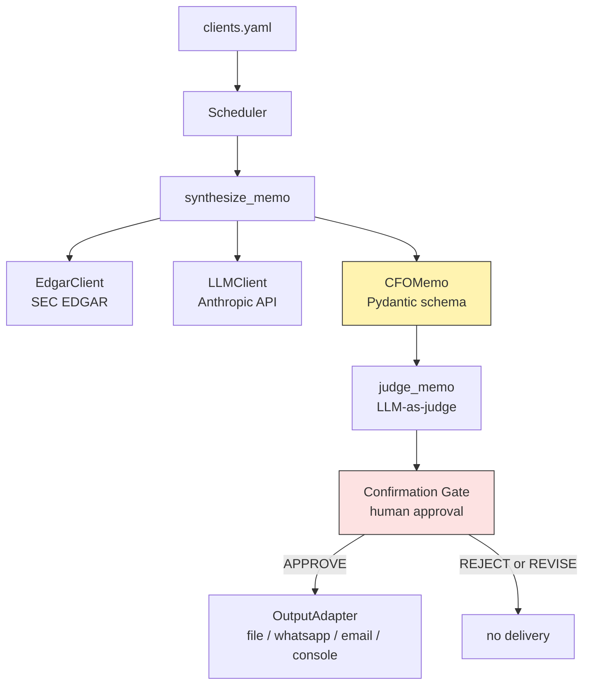

# Architecture

## Overview

`multi-agent-cfo` produces structured CFO-style memos for public companies on demand. Given a ticker, it fetches identifying data from SEC EDGAR, asks Claude to synthesize a memo grounded in publicly-known facts, evaluates the memo with an LLM-as-judge for quality regressions, and routes approved memos to configured output channels — all under human-in-the-loop confirmation.

The system is designed around three principles: **every external dependency is pluggable**, **every external call is observable and resilient**, and **the LLM is never trusted to produce valid output without explicit validation**.

## System diagram

Yellow box = schema-validated trust boundary. Red box = human trust boundary. All external calls (D, E) are wrapped in per-host circuit breakers with retry on transient errors.

## Layers

### Intelligence (`multi_agent_cfo/intelligence/`)

Composes external data with LLM generation to produce structured memos.

- **`EdgarClient`** wraps the SEC EDGAR public API: ticker → CIK → SIC industry. The ticker registry is process-locally cached (~1MB, changes infrequently). All HTTP calls go through an explicit timeout, a narrow retry predicate (5xx, 429, network errors only — never 4xx), and the `sec-edgar` circuit breaker.
- **`LLMClient`** wraps the Anthropic SDK with an outer tenacity retry layered on top of the SDK's built-in retry. All calls go through the `anthropic-api` circuit breaker. Implements the `LLM` Protocol so downstream code is provider-agnostic.
- **`synthesize_memo`** orchestrates: company facts via Edgar, structured prompt via LLM, JSON parse, Pydantic validation against `CFOMemo`. Downstream code never sees malformed output — see [ADR 0003](adr/0003-pydantic-schema-as-llm-trust-boundary.md).

### Evaluation (`multi_agent_cfo/evals/`)

`judge_memo` runs a separate Claude call to score the memo on four dimensions (specificity, grounding, actionability, numeric_honesty) on a 1-5 scale, with `passes` requiring all dimensions ≥3 and mean ≥3.5. Output is validated against `JudgeScores`. The judge is **advisory** — it produces signal for development; the human Confirmation Gate remains the trust boundary for delivery.

### Confirmation Gate (`multi_agent_cfo/gate/`)

The `ConfirmationAdapter` Protocol abstracts human approval. The default `ConsoleAdapter` displays the formatted memo and prompts for approve/reject/revise. Future adapters (Slack, web UI, mobile) plug in without changing the scheduler.

### Output (`multi_agent_cfo/output/`)

The `OutputAdapter` Protocol abstracts post-approval delivery. Shipped concrete adapters: `ConsoleOutputAdapter`, `FileOutputAdapter` (writes `YYYY-MM-DD_TICKER.md`), `WhatsAppOutputAdapter` (stub), `EmailOutputAdapter` (stub). Only `APPROVE` triggers delivery. Delivery failures are non-fatal — the decision counts, only the side-effect is lost.

### Scheduler (`multi_agent_cfo/scheduler/`)

`run_scheduler` orchestrates one pipeline iteration per client from `clients.yaml`. Per-client failures are caught and recorded but do not terminate the run. The function accepts injectable `adapter`, `output`, `edgar`, and `llm` parameters — production calls use defaults; tests pass fakes.

### Observability (`multi_agent_cfo/observability/`)

Dual-output logging:
- **Human-readable to stderr** — `HH:MM:SSZ LEVEL [run=<id> client=<ticker>] message` — keeps demos watchable.
- **JSONL to `logs/run-<timestamp>.jsonl`** — stable schema for machine tooling (grep, jq, pandas).

Correlation IDs (`run_id`, `client`) propagate via `contextvars` so they reach every log record without threading IDs through call signatures. Noisy third-party loggers (`httpcore`, `anthropic._base_client`) are suppressed at DEBUG so prompt content never lands in logs implicitly.

### Resilience (`multi_agent_cfo/resilience/`)

Per-host `CircuitBreaker` instances for SEC EDGAR and the Anthropic API. State machine: CLOSED → OPEN (after N consecutive failures) → HALF_OPEN (single probe after cooldown) → CLOSED or OPEN depending on probe outcome. Defaults: 5 consecutive failures, 60-second cooldown. Retry sits inside the breaker, not outside — see [ADR 0002](adr/0002-retry-inside-circuit-breaker.md).

## Trust boundaries

Two distinct trust boundaries protect the system:

1. **Pydantic schema validation** sits between LLM output and downstream code. If Claude returns malformed JSON, missing fields, or out-of-range scores, the schema layer raises `ValidationError` and the rest of the pipeline never sees the bad data.
2. **Human confirmation** sits between automated processing and external delivery. The LLM-as-judge is advisory only; nothing reaches an output channel without explicit human approval.

## Failure model

| Failure | Where caught | Behavior |
|---|---|---|
| EDGAR connection error, timeout, 5xx, 429 | EdgarClient (tenacity) | Retry up to 3x with exponential backoff |
| EDGAR returns 4xx (not found, etc.) | EdgarClient | Raised immediately (no retry) |
| EDGAR 5xx persists past retries | sec-edgar circuit breaker | Trips after 5 logical failures, fails fast for 60s |
| Anthropic transient error | LLMClient (SDK retry + tenacity) | Multi-layer retry |
| Anthropic API persistent failure | anthropic-api circuit breaker | Trips after 5 logical failures, fails fast for 60s |
| LLM returns invalid JSON | json.loads / Pydantic | ValidationError, caught by scheduler |
| Synthesis raises | Scheduler | Logged, recorded as failure, continue to next client |
| Judge raises | Scheduler | Logged, non-fatal, decision still happens |
| Output adapter raises | Scheduler | Logged, decision still counts, delivered=False |
| Human rejects/revises | Scheduler | No output delivery |

All failure paths are covered by the test matrix in `tests/`.

## Design principles

- **Protocol over ABC** for adapter interfaces — see [ADR 0001](adr/0001-protocol-based-adapters.md).
- **Retry inside circuit breaker** — see [ADR 0002](adr/0002-retry-inside-circuit-breaker.md).
- **Pydantic schema as LLM trust boundary** — see [ADR 0003](adr/0003-pydantic-schema-as-llm-trust-boundary.md).
- **Dependency injection at the seam, defaults at the call site.** Public API accepts optional concrete dependencies (`edgar=`, `llm=`); production callers pass nothing; tests pass fakes.
- **Logs are operational telemetry, not UI.** Operational events go to the structured logger. Interactive content (memo display, prompts, run summary banner) stays on stdout.

## Extension points

- **Add a new LLM provider**: implement the `LLM` Protocol (one method: `complete(*, system, user, max_tokens) -> LLMResponse`) and pass an instance to `run_scheduler(llm=...)`. No changes to `synthesize_memo` or `judge_memo`.
- **Add a new output channel**: implement `OutputAdapter` (one method: `deliver(synthesis) -> None`) and pass to `run_scheduler(output=...)`.
- **Add a new confirmation surface**: implement `ConfirmationAdapter` and pass to `run_scheduler(adapter=...)`. Slack/web/mobile UIs all fit this seam.
- **Add a new client**: append an entry to `clients/clients.yaml`. No code changes needed.

## Test matrix

23 tests across three files:
- `tests/test_circuit_breaker.py` — state machine transitions (7 tests)
- `tests/test_schemas.py` — Pydantic validation for `CFOMemo` and `JudgeScores` (10 tests)
- `tests/test_scheduler.py` — integration tests with fake LLM/Edgar/output/gate covering happy path, synthesis failure, judge failure, output failure, reject/revise decisions, and cleanup (6 tests)

Run: `pytest -v`.
